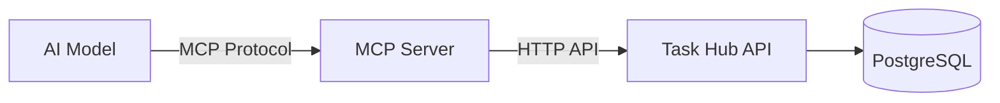
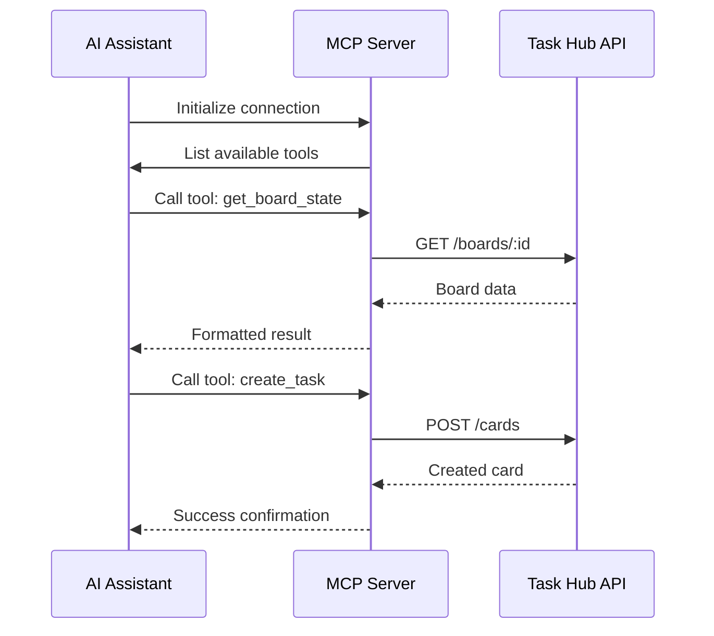
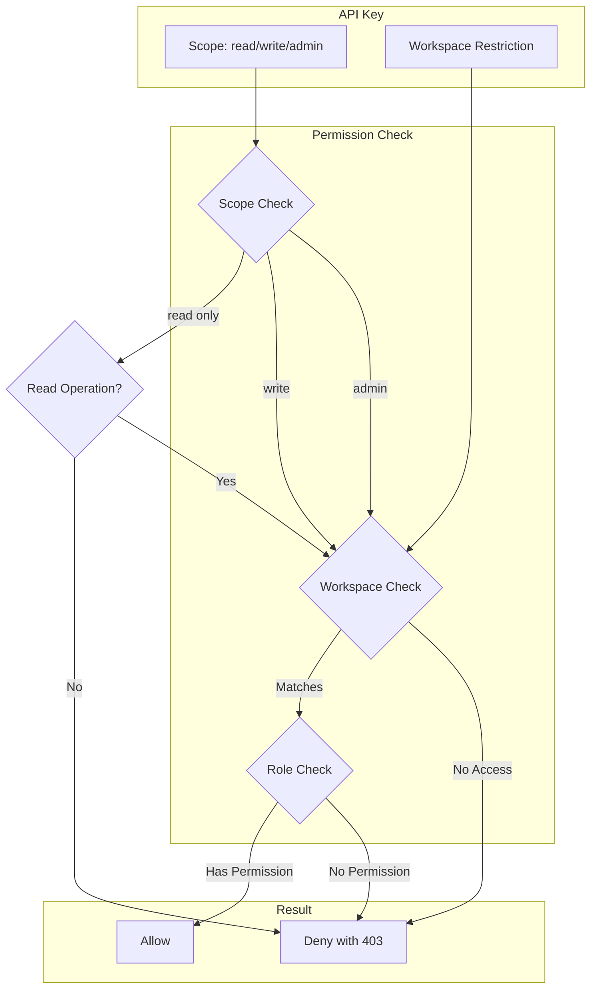

# Task Hub - Model Context Protocol (MCP)

**Version:** 1.0.0  
**Last Updated:** 2026-01-30  
**MCP Protocol Version:** 2024-11-05  

---

## Table of Contents

1. [Overview](#1-overview)
2. [What is MCP?](#2-what-is-mcp)
3. [Quick Start](#3-quick-start)
4. [Configuration](#4-configuration)
5. [Available Tools](#5-available-tools)
6. [Tool Reference](#6-tool-reference)
7. [Security & Permissions](#7-security--permissions)
8. [Best Practices](#8-best-practices)
9. [Error Handling](#9-error-handling)
10. [Examples](#10-examples)

---

## 1. Overview

Task Hub implements the **Model Context Protocol (MCP)**, an open protocol that enables seamless integration between AI systems and external data sources. This allows AI assistants like Claude, GPT, and other LLMs to directly interact with your Task Hub workspaces, boards, and cards.

### Key Capabilities

- **Read Operations**: AI can view workspaces, boards, lists, and cards
- **Write Operations**: AI can create, update, and move tasks
- **Search**: AI can find specific cards across boards
- **Context Awareness**: AI maintains understanding of your project structure

### Supported MCP Clients

| Client | Status | Transport |
|--------|--------|-----------|
| Claude Desktop | ✅ Supported | stdio |
| Cursor IDE | ✅ Supported | stdio |
| Custom Clients | ✅ Supported | stdio/SSE |
| Cline | 🚧 Planned | stdio |

---

## 2. What is MCP?

The Model Context Protocol (MCP) is a standardized interface that allows AI models to discover and use external tools. Think of it as a "USB-C port" for AI applications - providing a uniform way to connect AI models to different data sources and tools.

### How It Works



1. **AI Model** sends a request to the MCP Server using the MCP protocol
2. **MCP Server** translates the request into Task Hub API calls
3. **Task Hub API** processes the request and returns data
4. **MCP Server** formats the response for the AI Model

### Protocol Flow



---

## 3. Quick Start

### Step 1: Generate an API Key

1. Log in to Task Hub
2. Go to Settings → API Keys
3. Click "Create New Key"
4. Select scope: `read` for read-only, `write` for full access
5. Copy the key (starts with `tk_`)

### Step 2: Configure Your MCP Client

#### Claude Desktop (macOS)

Edit `~/Library/Application Support/Claude/claude_desktop_config.json`:

```json
{
  "mcpServers": {
    "task-hub": {
      "command": "bun",
      "args": [
        "run",
        "/path/to/task-hub/api/src/mcp/index.ts"
      ],
      "env": {
        "TASK_HUB_API_KEY": "tk_your_api_key_here",
        "TASK_HUB_URL": "http://localhost:8000",
        "TASK_HUB_LOG_LEVEL": "info"
      }
    }
  }
}
```

#### Cursor IDE

Add to Cursor Settings → MCP:

```json
{
  "mcpServers": {
    "task-hub": {
      "command": "bun",
      "args": ["run", "/path/to/task-hub/api/src/mcp/index.ts"],
      "env": {
        "TASK_HUB_API_KEY": "tk_your_api_key_here",
        "TASK_HUB_URL": "http://localhost:8000"
      }
    }
  }
}
```

### Step 3: Start Using

Once configured, you can ask your AI assistant:

- "Show me all my workspaces"
- "What tasks are in my Engineering board?"
- "Create a new task called 'Review PR #123' in the In Progress column"
- "Move the 'Deploy to Production' card to Done"

---

## 4. Configuration

### Environment Variables

| Variable | Required | Default | Description |
|----------|----------|---------|-------------|
| `TASK_HUB_API_KEY` | ✅ | - | Your Task Hub API key |
| `TASK_HUB_URL` | ✅ | - | Task Hub API base URL |
| `TASK_HUB_LOG_LEVEL` | ❌ | `info` | Logging level (debug, info, warn, error) |
| `TASK_HUB_TIMEOUT` | ❌ | `30000` | Request timeout in milliseconds |
| `TASK_HUB_RETRY_COUNT` | ❌ | `3` | Number of retries for failed requests |

### API Key Scopes

| Scope | Permissions | Use Case |
|-------|-------------|----------|
| `read` | View workspaces, boards, cards | Safe analysis, reporting |
| `write` | Read + Create/Update/Delete tasks | Task automation, creation |
| `admin` | Full access including user management | Advanced automation |

### Workspace Scoping

You can optionally restrict an API key to a specific workspace:

1. When creating the key, select "Restrict to Workspace"
2. Choose the workspace from the dropdown
3. AI will only see data from that workspace

---

## 5. Available Tools

### Tool Categories

| Category | Tools | Description |
|----------|-------|-------------|
| **Discovery** | `list_workspaces`, `get_workspace` | Browse available workspaces |
| **Boards** | `get_board_state`, `list_boards` | View board contents |
| **Cards** | `create_task`, `update_task`, `move_task` | Task management |
| **Search** | `search_cards`, `filter_cards` | Find specific tasks |
| **Comments** | `add_comment`, `list_comments` | Collaboration |

### Tool Summary Table

| Tool | Scope | Description | Risk Level |
|------|-------|-------------|------------|
| `list_workspaces` | read | List all accessible workspaces | 🟢 Low |
| `get_workspace` | read | Get workspace details | 🟢 Low |
| `list_boards` | read | List boards in workspace | 🟢 Low |
| `get_board_state` | read | Get full board with lists/cards | 🟢 Low |
| `search_cards` | read | Search for cards | 🟢 Low |
| `create_task` | write | Create a new card | 🟡 Medium |
| `update_task` | write | Update card fields | 🟡 Medium |
| `move_task` | write | Move card between lists | 🟡 Medium |
| `delete_task` | write | Archive/delete a card | 🔴 High |
| `add_comment` | write | Add comment to card | 🟡 Medium |
| `list_comments` | read | View card comments | 🟢 Low |

---

## 6. Tool Reference

### 6.1 Discovery Tools

#### list_workspaces

List all workspaces the API key has access to.

**Parameters:** None

**Returns:**
```json
{
  "workspaces": [
    {
      "id": "550e8400-e29b-41d4-a716-446655440000",
      "name": "Engineering",
      "slug": "engineering",
      "description": "Engineering team workspace",
      "visibility": "private",
      "role": "admin",
      "boardCount": 5,
      "memberCount": 12
    }
  ]
}
```

**Example Usage:**
```
"Show me all my workspaces"
```

---

#### get_workspace

Get detailed information about a specific workspace.

**Parameters:**
| Name | Type | Required | Description |
|------|------|----------|-------------|
| `workspaceId` | string | ✅ | Workspace UUID |

**Returns:**
```json
{
  "id": "550e8400-e29b-41d4-a716-446655440000",
  "name": "Engineering",
  "slug": "engineering",
  "description": "Engineering team workspace",
  "visibility": "private",
  "settings": {
    "allowGuests": false,
    "defaultBoardVisibility": "private",
    "enableTimeTracking": false
  },
  "boards": [
    {
      "id": "...",
      "name": "Sprint 24",
      "archived": false
    }
  ],
  "members": [
    {
      "id": "...",
      "name": "Alice Smith",
      "role": "admin"
    }
  ]
}
```

---

#### list_boards

List all boards in a workspace.

**Parameters:**
| Name | Type | Required | Description |
|------|------|----------|-------------|
| `workspaceId` | string | ✅ | Workspace UUID |
| `includeArchived` | boolean | ❌ | Include archived boards (default: false) |

**Returns:**
```json
{
  "boards": [
    {
      "id": "660e8400-e29b-41d4-a716-446655440001",
      "name": "Sprint 24",
      "visibility": "team",
      "template": "scrum",
      "archived": false,
      "listCount": 5,
      "cardCount": 42
    }
  ]
}
```

---

### 6.2 Board Tools

#### get_board_state

Get the complete state of a board including all lists and cards. This is the primary tool for understanding board context.

**Parameters:**
| Name | Type | Required | Description |
|------|------|----------|-------------|
| `boardId` | string | ✅ | Board UUID |
| `includeArchived` | boolean | ❌ | Include archived cards (default: false) |

**Returns:**
```json
{
  "board": {
    "id": "660e8400-e29b-41d4-a716-446655440001",
    "name": "Sprint 24",
    "description": "Q1 2026 Sprint",
    "visibility": "team",
    "background": {
      "type": "color",
      "value": "#0079bf"
    }
  },
  "lists": [
    {
      "id": "770e8400-e29b-41d4-a716-446655440002",
      "name": "To Do",
      "position": 0,
      "wipLimit": 10,
      "cards": [
        {
          "id": "880e8400-e29b-41d4-a716-446655440003",
          "title": "Implement user authentication",
          "description": "Add OAuth integration...",
          "priority": "high",
          "dueDate": "2026-02-15T00:00:00Z",
          "position": 0,
          "assignees": ["Alice Smith"],
          "labels": [{"name": "Backend", "color": "#ff0000"}],
          "commentCount": 3,
          "attachmentCount": 2,
          "checklistProgress": {
            "total": 5,
            "completed": 2
          }
        }
      ]
    }
  ]
}
```

**Example Usage:**
```
"Show me the current state of my Sprint 24 board"
"What tasks are in the In Progress column?"
"Give me an overview of all cards on the Engineering board"
```

---

### 6.3 Card Management Tools

#### create_task

Create a new card (task) on a board.

**Parameters:**
| Name | Type | Required | Description |
|------|------|----------|-------------|
| `title` | string | ✅ | Card title (1-200 chars) |
| `listId` | string | ✅ | Target list UUID |
| `description` | string | ❌ | Card description (markdown supported) |
| `priority` | enum | ❌ | `low`, `medium`, or `high` |
| `dueDate` | string | ❌ | ISO 8601 date string |
| `assigneeIds` | array | ❌ | Array of user UUIDs |
| `labelIds` | array | ❌ | Array of label UUIDs |

**Returns:**
```json
{
  "success": true,
  "card": {
    "id": "990e8400-e29b-41d4-a716-446655440004",
    "title": "Review PR #123",
    "listId": "770e8400-e29b-41d4-a716-446655440002",
    "position": 5,
    "priority": "medium",
    "createdAt": "2026-01-30T10:30:00Z"
  }
}
```

**Example Usage:**
```
"Create a task called 'Fix login bug' in the To Do list"
"Add a high priority card 'Deploy to production' to In Progress, due tomorrow"
"Create a task for 'Update documentation' and assign it to Alice"
```

**⚠️ Confirmation Recommended:** This tool modifies data. Consider requiring confirmation before execution.

---

#### update_task

Update fields of an existing card.

**Parameters:**
| Name | Type | Required | Description |
|------|------|----------|-------------|
| `cardId` | string | ✅ | Card UUID |
| `title` | string | ❌ | New title |
| `description` | string | ❌ | New description |
| `priority` | enum | ❌ | New priority |
| `dueDate` | string | ❌ | New due date (null to clear) |
| `startDate` | string | ❌ | New start date |
| `coverImage` | string | ❌ | Cover image URL (null to clear) |
| `archived` | boolean | ❌ | Archive status |

**Returns:**
```json
{
  "success": true,
  "card": {
    "id": "990e8400-e29b-41d4-a716-446655440004",
    "title": "Review PR #123 - Updated",
    "priority": "high",
    "updatedAt": "2026-01-30T10:35:00Z"
  },
  "changes": {
    "title": "Review PR #123 - Updated",
    "priority": "high"
  }
}
```

**Example Usage:**
```
"Update the 'Fix login bug' card to high priority"
"Change the due date of the deployment task to next Friday"
"Archive the completed documentation task"
```

---

#### move_task

Move a card to a different list and/or position.

**Parameters:**
| Name | Type | Required | Description |
|------|------|----------|-------------|
| `cardId` | string | ✅ | Card UUID |
| `listId` | string | ✅ | Target list UUID |
| `position` | number | ✅ | New position in list (0-based) |

**Returns:**
```json
{
  "success": true,
  "card": {
    "id": "990e8400-e29b-41d4-a716-446655440004",
    "listId": "880e8400-e29b-41d4-a716-446655440005",
    "position": 0
  },
  "previous": {
    "listId": "770e8400-e29b-41d4-a716-446655440002",
    "position": 5
  }
}
```

**Example Usage:**
```
"Move the login bug fix to In Progress"
"Move 'Deploy to production' to the Done column"
"Reorder the cards in To Do to put the urgent items first"
```

---

#### delete_task

Archive or permanently delete a card.

**Parameters:**
| Name | Type | Required | Description |
|------|------|----------|-------------|
| `cardId` | string | ✅ | Card UUID |
| `permanent` | boolean | ❌ | Permanent deletion (default: false - archive only) |

**Returns:**
```json
{
  "success": true,
  "action": "archived",
  "cardId": "990e8400-e29b-41d4-a716-446655440004"
}
```

**⚠️ Confirmation Required:** This tool is destructive. Always require explicit confirmation before execution.

---

### 6.4 Search Tools

#### search_cards

Search for cards across boards using text search.

**Parameters:**
| Name | Type | Required | Description |
|------|------|----------|-------------|
| `query` | string | ✅ | Search text |
| `boardId` | string | ❌ | Restrict to specific board |
| `workspaceId` | string | ❌ | Restrict to specific workspace |
| `limit` | number | ❌ | Max results (default: 20, max: 100) |

**Returns:**
```json
{
  "total": 15,
  "cards": [
    {
      "id": "...",
      "title": "Fix authentication bug",
      "boardName": "Sprint 24",
      "listName": "In Progress",
      "priority": "high",
      "matches": {
        "title": "authentication"
      }
    }
  ]
}
```

**Example Usage:**
```
"Find all cards about authentication"
"Search for tasks assigned to Alice"
"Look for cards with 'urgent' in the description"
```

---

#### filter_cards

Filter cards by various criteria.

**Parameters:**
| Name | Type | Required | Description |
|------|------|----------|-------------|
| `boardId` | string | ✅ | Board UUID |
| `listId` | string | ❌ | Filter by list |
| `assigneeId` | string | ❌ | Filter by assignee |
| `priority` | enum | ❌ | Filter by priority |
| `dueBefore` | string | ❌ | Due before date (ISO 8601) |
| `dueAfter` | string | ❌ | Due after date (ISO 8601) |
| `archived` | boolean | ❌ | Include archived (default: false) |
| `labelId` | string | ❌ | Filter by label |

**Returns:**
```json
{
  "total": 8,
  "cards": [
    {
      "id": "...",
      "title": "Deploy to production",
      "priority": "high",
      "dueDate": "2026-01-30T23:59:59Z",
      "listName": "To Do"
    }
  ]
}
```

**Example Usage:**
```
"Show me all high priority cards"
"Find cards due this week"
"List all cards assigned to me in the In Progress column"
```

---

### 6.5 Collaboration Tools

#### add_comment

Add a comment to a card.

**Parameters:**
| Name | Type | Required | Description |
|------|------|----------|-------------|
| `cardId` | string | ✅ | Card UUID |
| `content` | string | ✅ | Comment text (max 5000 chars) |

**Returns:**
```json
{
  "success": true,
  "comment": {
    "id": "aa0e8400-e29b-41d4-a716-446655440006",
    "content": "This looks good to me! Approved.",
    "createdAt": "2026-01-30T10:40:00Z",
    "author": "AI Assistant"
  }
}
```

---

#### list_comments

List comments on a card.

**Parameters:**
| Name | Type | Required | Description |
|------|------|----------|-------------|
| `cardId` | string | ✅ | Card UUID |
| `limit` | number | ❌ | Max comments (default: 50) |
| `cursor` | string | ❌ | Pagination cursor |

**Returns:**
```json
{
  "comments": [
    {
      "id": "...",
      "content": "Need to update the tests",
      "author": "Alice Smith",
      "createdAt": "2026-01-29T14:30:00Z"
    }
  ],
  "hasMore": false
}
```

---

## 7. Security & Permissions

### Permission Model



### Scope Behavior

| Scope | list_workspaces | get_board_state | create_task | delete_task |
|-------|-----------------|-----------------|-------------|-------------|
| `read` | ✅ | ✅ | ❌ | ❌ |
| `write` | ✅ | ✅ | ✅ | ✅ |
| `admin` | ✅ | ✅ | ✅ | ✅ |

### Workspace Restriction

When an API key is scoped to a specific workspace:

- AI can only see that workspace and its contents
- Attempts to access other workspaces return 403
- Board and card operations are limited to the scoped workspace

### Recommended Security Practices

1. **Use Read-Only Keys for Analysis**
   - Create `read` scope keys when AI only needs to view data
   - Safer for general-purpose AI assistants

2. **Workspace-Specific Keys**
   - Restrict keys to specific workspaces when possible
   - Limits blast radius if key is compromised

3. **Human-in-the-Loop for Destructive Operations**
   ```json
   {
     "mcpServers": {
       "task-hub": {
         "command": "bun",
         "args": [...],
         "env": {...},
         "requireConfirmation": [
           "create_task",
           "update_task",
           "move_task",
           "delete_task"
         ]
       }
     }
   }
   ```

4. **Key Rotation**
   - Set expiration dates on API keys
   - Regularly rotate keys (every 90 days recommended)
   - Monitor usage logs for anomalies

---

## 8. Best Practices

### For AI Assistant Developers

1. **Context Management**
   - Call `get_board_state` at conversation start to understand context
   - Cache board state for the duration of the conversation
   - Refresh when user mentions changes

2. **Error Handling**
   - Always handle rate limit errors (429) with exponential backoff
   - Provide helpful messages for permission errors (403)
   - Validate user input before making API calls

3. **User Experience**
   - Confirm before destructive operations
   - Show previews of changes when possible
   - Use natural language to describe actions taken

4. **Efficiency**
   - Use `get_board_state` instead of multiple individual calls
   - Batch related operations when possible
   - Respect rate limits

### Example Conversation Flow

```
User: "What's on my plate for today?"

AI: [Calls list_workspaces]
     [Calls get_board_state for primary workspace]

AI: "You have 3 tasks in your Engineering workspace:
     
     🔴 High Priority:
     - 'Fix critical bug' in In Progress
     
     🟡 Medium Priority:
     - 'Review PR #123' in To Do
     
     All tasks are due today. Would you like me to 
     prioritize or move any of these?"

User: "Move the PR review to In Progress"

AI: [Calls move_task for PR review card]

AI: "Done! I've moved 'Review PR #123' to In Progress."
```

---

## 9. Error Handling

### Error Types

| Code | HTTP Status | Description | Action |
|------|-------------|-------------|--------|
| `UNAUTHORIZED` | 401 | Invalid or expired API key | Check key, re-authenticate |
| `FORBIDDEN` | 403 | Insufficient permissions | Use key with higher scope |
| `NOT_FOUND` | 404 | Resource doesn't exist | Verify ID, check access |
| `VALIDATION_ERROR` | 400 | Invalid input | Check parameters |
| `RATE_LIMITED` | 429 | Too many requests | Wait and retry |
| `INTERNAL_ERROR` | 500 | Server error | Retry with backoff |

### Error Response Format

```json
{
  "success": false,
  "error": {
    "code": "VALIDATION_ERROR",
    "message": "Invalid card ID format",
    "details": {
      "cardId": "Must be a valid UUID"
    }
  }
}
```

### Retry Strategy

```typescript
// Exponential backoff with jitter
async function retryWithBackoff<T>(
  operation: () => Promise<T>,
  maxRetries: number = 3
): Promise<T> {
  for (let i = 0; i < maxRetries; i++) {
    try {
      return await operation();
    } catch (error) {
      if (error.code === 'RATE_LIMITED') {
        const delay = Math.min(1000 * Math.pow(2, i), 30000);
        const jitter = Math.random() * 1000;
        await sleep(delay + jitter);
        continue;
      }
      throw error;
    }
  }
  throw new Error('Max retries exceeded');
}
```

---

## 10. Examples

### Example 1: Daily Standup Summary

```
User: "Give me a standup summary for the Engineering board"

AI: [Calls get_board_state for Engineering board]

AI: "Here's your standup summary for Sprint 24:

     **Done (3 cards):**
     - Database migration completed ✓
     - API documentation updated ✓
     - Unit tests for auth module ✓

     **In Progress (2 cards):**
     - Implement OAuth flow (Alice) - 80% complete
     - Fix caching issue (Bob) - blocked on Redis config

     **Blocked (1 card):**
     - Deploy to staging - waiting for DevOps review

     **To Do (4 cards):**
     - Performance optimization
     - Update dependencies
     - Code review: PR #125
     - Write integration tests"
```

### Example 2: Task Creation Workflow

```
User: "I need to add a task for the new feature we discussed"

AI: "I'd be happy to help create that task. I need a few details:

     1. What should the task be called?
     2. Which board and list should it go in?
     3. What's the priority?
     4. Any description or due date?"

User: "Call it 'Implement dark mode', put it in Sprint 24 
       To Do, high priority, due Friday"

AI: [Calls create_task with provided details]

AI: "✅ Created 'Implement dark mode' in Sprint 24 To Do
     with high priority, due Friday. 
     
     Card ID: 990e8400-e29b-41d4-a716-446655440004"
```

### Example 3: Sprint Planning

```
User: "Help me plan the next sprint"

AI: [Calls list_workspaces]
     [Calls list_boards for Engineering workspace]
     [Calls get_board_state for current sprint board]

AI: "I can see your current sprint (Sprint 24) has 12 cards:
     - 3 Done
     - 4 In Progress  
     - 5 To Do
     
     Based on velocity, you have capacity for about 8 more 
     story points. Would you like me to:
     
     1. Create a new board for Sprint 25
     2. Move incomplete cards from Sprint 24
     3. Help you estimate and add new tasks?"

User: "Yes to all three"

AI: [Proceeds with multi-step workflow...]
```

### Example 4: Code Review Integration

```
User: "Review my open PRs and create tasks for any issues"

AI: [External tool: list GitHub PRs]
     [Calls get_board_state to find relevant board]

AI: "I reviewed 3 open PRs:

     PR #123 (auth-fix):
     - Tests missing → Created task 'Add tests for auth fix'
     - Documentation needs update → Created task 'Update auth docs'

     PR #124 (feature-x):
     - No issues found! Ready to merge.

     PR #125 (refactor):
     - Performance regression detected → Created high priority 
       task 'Fix performance regression in refactor'

     All tasks added to your Code Review board."
```

---

## Appendix A: MCP Protocol Details

### JSON-RPC Messages

**Initialize:**
```json
{
  "jsonrpc": "2.0",
  "id": 1,
  "method": "initialize",
  "params": {
    "protocolVersion": "2024-11-05",
    "capabilities": {},
    "clientInfo": {
      "name": "claude-desktop",
      "version": "1.0.0"
    }
  }
}
```

**Tool Call:**
```json
{
  "jsonrpc": "2.0",
  "id": 2,
  "method": "tools/call",
  "params": {
    "name": "get_board_state",
    "arguments": {
      "boardId": "660e8400-e29b-41d4-a716-446655440001"
    }
  }
}
```

### Transport Options

| Transport | Use Case | Configuration |
|-----------|----------|---------------|
| stdio | Local clients (Claude Desktop, Cursor) | Default |
| SSE | Remote/cloud deployments | `TRANSPORT=sse` |
| HTTP | Custom integrations | Via MCP proxy |

---

## Appendix B: Troubleshooting

### Common Issues

**"Connection refused"**
- Check TASK_HUB_URL is correct
- Verify Task Hub API is running
- Check firewall/network settings

**"Unauthorized"**
- Verify API key is valid and not expired
- Check key hasn't been revoked
- Ensure key has correct scope

**"Rate limited"**
- Reduce request frequency
- Upgrade API key tier
- Implement client-side caching

**"Tool not found"**
- Update MCP server to latest version
- Check tool name spelling
- Verify MCP protocol version compatibility

### Debug Mode

Enable debug logging:

```json
{
  "mcpServers": {
    "task-hub": {
      "command": "bun",
      "args": [...],
      "env": {
        "TASK_HUB_LOG_LEVEL": "debug",
        "TASK_HUB_DEBUG": "true"
      }
    }
  }
}
```

---

*For questions or issues, please visit: https://github.com/ahmed-lotfy-dev/task-hub/issues*
